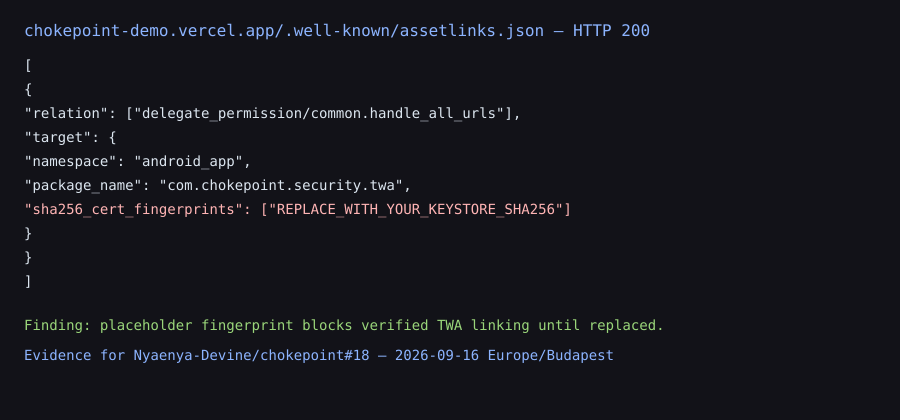

# Chokepoint — Dual-Control Security Plane


[](https://vercel.com/new/clone?repository-url=https%3A%2F%2Fgithub.com%2FNyaenya-Devine%2Fchokepoint)

**Live Demo:** https://chokepoint-demo.vercel.app · **Portfolio:** https://devine-nyaenya-portfolio.vercel.app · **Stars welcome ⭐**

**Least-privilege dual-control access plane with HMAC-signed, hash-chained tamper-evident audit — for humans and AI agents.**

> **For Security Engineers, AppSec, and Zero Trust teams** — demonstrates end-to-end security ownership: RBAC, 4-eyes approval, provable audit trail, anomaly detection, policy simulation, and hardened desktop packaging.

Chokepoint is a full-stack security product with role-based authentication, two-person approval, a hash-chained tamper-evident audit log, explainable anomaly detection, policy simulation and SIEM export controls.

> **Hosted demo:** deployments should use deployment-specific credentials. Production deployments must never rely on repository-shipped passwords.

## ✨ What it does

| Feature | Why it matters |
| --- | --- |
| **Role-based auth** | Every protected API action is authorization-gated. |
| **Dual-control** | Irreversible actions require a second, distinct, authorized approver. |
| **Tamper-evident audit log** | Events are SHA-256 hash-chained and HMAC-signed. |
| **Anomaly / risk detection** | Suspicious activity is surfaced with human-readable reasons. |
| **Policy simulation** | Policies can be tested without committing changes. |
| **SIEM export** | Audit export requires the dedicated `export_log` permission. |
| **Electron desktop build** | Hardened Electron packaging with signed-update verification. |

## 🚀 Getting started

Requires **Node 22+** for the current Electron toolchain.

```bash
git clone <your-fork> && cd chokepoint
npm install
npm run dev
```

Production build:

```bash
npm run build
npm run start
```

### Production credentials

Development mode retains convenience seed accounts for the security lab. **They are not production credentials.**

Production requires unique deployment values for:

```text
CHOKEPOINT_SECRET=<32+ random characters>
CHOKEPOINT_SESSION_SECRET=<strong random session secret>
CHOKEPOINT_ADMIN_PASSWORD=<unique password>
CHOKEPOINT_OPERATOR_PASSWORD=<unique password>
CHOKEPOINT_AUDITOR_PASSWORD=<unique password>
CHOKEPOINT_VIEWER_PASSWORD=<unique password>
```

Never commit real values. Production startup fails closed when required secrets are absent or too weak.


## 📱 Android TWA install check

Issue tracker: [#18](https://github.com/Nyaenya-Devine/chokepoint/issues/18)

Live Asset Links: [`/.well-known/assetlinks.json`](https://chokepoint-demo.vercel.app/.well-known/assetlinks.json) on the demo host returns HTTP 200 for package `com.chokepoint.security.twa`, but the cert fingerprint is still the placeholder `REPLACE_WITH_YOUR_KEYSTORE_SHA256`, so a verified TWA install cannot succeed until a real keystore fingerprint is published.



Full notes and Android device steps: [docs/twa-android-install.md](docs/twa-android-install.md).

## 🧪 Tests

```bash
npm test
```

The tests cover ledger tamper detection, RBAC and dual-control rules, password hashing, timing-safe comparisons and anomaly detection.

## 🏗️ Architecture

```text
Clients (web / PWA / desktop)
        │
        ▼
Next.js App Router ──► Session (HttpOnly, SameSite=Strict, signed cookie)
        │                        │
        ▼                        ▼
  Policy engine (lib/authz)   Dual-control (approve/reject mandates)
        │                        │
        ▼                        ▼
  Tamper-evident audit ledger (hash chain + HMAC)  ──►  Anomaly detection
```

Key modules:

| Module | Responsibility |
| --- | --- |
| `lib/crypto.ts` | PBKDF2-SHA256, HMAC-SHA256, SHA-256, constant-time compare. |
| `lib/ledger.ts` | Append-only hash-chained, HMAC-signed event log. |
| `lib/authz.ts` | RBAC policy matrix and dual-control authorization. |
| `lib/anomaly.ts` | Explainable risk scoring and severity classification. |
| `lib/session.ts` | Signed, HttpOnly, expiring session cookie. |
| `lib/store.ts` | In-memory store + development seed data. |

## 🛡️ Security posture

See [**SECURITY.md**](./public/SECURITY.md) for the threat model and security decisions.

Highlights:

- **Tamper-evidence:** hash chain + HMAC with strict order-preserving verification.
- **Separation of duties:** a requester cannot approve their own privileged mandate.
- **Credential hygiene:** PBKDF2-SHA256, per-user salt, timing-safe comparisons.
- **Session hygiene:** HttpOnly, SameSite=Strict, signed, expiring cookies.
- **Transport hardening:** CSP, HSTS, frame protection, `nosniff` and Permissions-Policy.
- **Authorization hardening:** privileged exports and mutation endpoints use dedicated permissions.
- **Production fail-closed:** strong secrets and deployment-specific passwords are required.
- **Desktop hardening:** Electron 44.3.0, sandbox, context isolation, disabled Node integration and signed-update verification.
- **Supply-chain controls:** dependency audit, CodeQL, dependency review, secret scanning and SBOM generation run in CI.

## 🧭 Project intent

Chokepoint demonstrates end-to-end security ownership: authentication, authorization boundaries, dual control, a provable audit trail, security tests, automated scanning, supply-chain controls and hardened desktop packaging.

Built with **Next.js 16 (App Router) + TypeScript**, tested with Vitest and deployed to Vercel.
